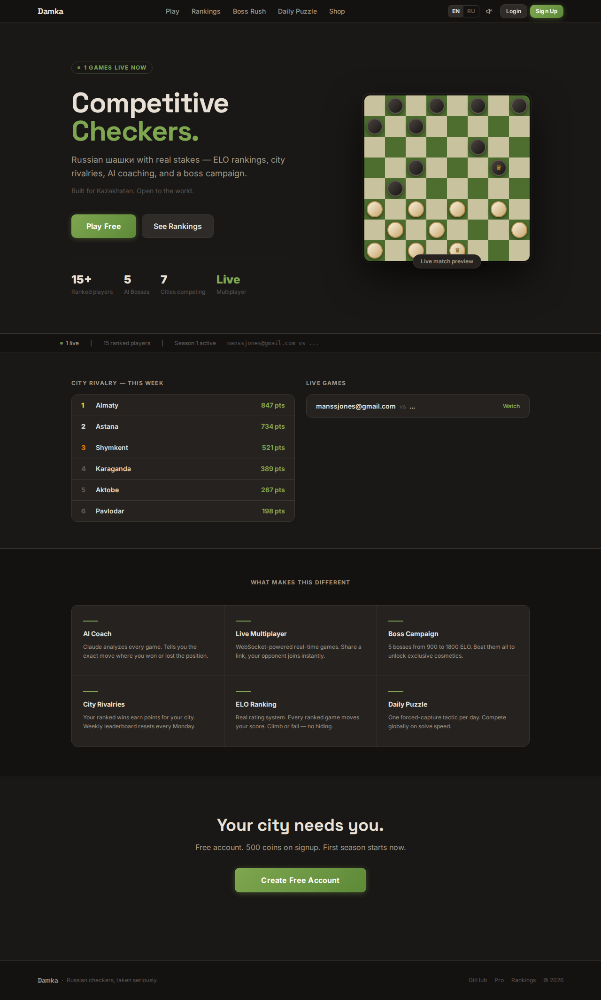

# Дамка

Конкурентная платформа для игры в русские шашки. Мультиплеер в реальном времени, рейтинг ELO, ИИ-тренер, городское соперничество.

**Сайт:** https://damka-a5p3.onrender.com  
**GitHub:** https://github.com/IManss-ai/damka

---



---

## Что это такое

Русские шашки — самая популярная настольная игра в Центральной Азии. Серьёзной онлайн-платформы для неё не существовало. Дамка — это она.

Это не просто шашечная доска. Это конкурентная система, построенная вокруг игры — так же, как chess.com построен вокруг шахмат. Идея проста: если дать игрокам рейтинг ELO, городское соперничество, ежедневные задачи, кампанию боссов и разбор ошибок после каждого поражения — они вернутся. Игра — это контент; платформа создаёт причину оставаться.

## Возможности

| Функция | Описание |
|---|---|
| Живой мультиплеер | Поделитесь ссылкой — соперник присоединяется за 3 секунды. Другу нужен аккаунт. |
| Рейтинг ELO | Каждая рейтинговая партия меняет ваш рейтинг. Побеждаете сильных — получаете больше. |
| Городское соперничество | Победы идут в зачёт вашего города. Алматы против Астаны. Реальные ставки. |
| Блиц-режим | 3 минуты на игрока. Кончилось время — поражение. |
| Кампания боссов | 5 постепенно усложняющихся ИИ-соперников. Каждый открывает косметику при победе. |
| ИИ-тренер | После каждой партии Claude анализирует ваши ходы и объясняет, где вы упустили победу. |
| Ежедневная задача | Одна тактическая позиция в день, одинаковая для всех. Глобальный рейтинг по скорости. |
| Оценочная шкала | Индикатор преимущества позиции во время партии. |
| Магазин | Темы досок и наборы фигур за внутриигровые монеты. Доступен Pro-уровень. |
| Двуязычность | Полная поддержка русского и английского языков. |
| Игра с ботом | Нет соперника? Играйте против ИИ прямо из экрана ожидания — Лёгкий, Средний, Сложный. |

## Почему это работает как бизнес

Монетизация следует модели chess.com, применённой к другой игре:

- Монеты за победы, трата в магазине — петля удержания
- Косметика с градациями редкости — социальные сигналы статуса
- Pro-подписка за $4.99/месяц — безлимитный ИИ-тренер, эксклюзивные доски, Pro-значок
- Городское соперничество создаёт локальные сетевые эффекты, которые глобальные платформы не могут воспроизвести

## Технологический стек

- **Фронтенд:** React 18, Vite, TypeScript, Tailwind CSS
- **Бэкенд:** Node.js, Express, Socket.IO, Prisma, SQLite
- **ИИ:** Anthropic Claude API (Haiku) для разбора партий
- **Деплой:** Render (автодеплой из ветки main на GitHub)

## Запуск локально

```bash
# Бэкенд
cd server
npm install
cp .env.example .env          # добавьте ANTHROPIC_API_KEY и JWT_SECRET
npx prisma db push
npx ts-node prisma/seed.ts    # создаёт 15 тестовых игроков, боссов, задачу, косметику
npm run dev                   # запускается на порту 3001

# Фронтенд (новый терминал)
cd client
npm install
npm run dev                   # запускается на порту 5173, проксирует /api на 3001
```

Откройте `http://localhost:5173`

## Структура проекта

```
damka/
├── client/
│   └── src/
│       ├── pages/        # Landing, Play, Game, Leaderboard, Bosses, Puzzle, Shop, Pro, Profile
│       ├── components/   # Board, Navbar, Footer
│       └── lib/          # API-клиент, Socket.IO, звуки, конфетти, i18n
├── server/
│   └── src/
│       ├── routes/       # REST: auth, leaderboard, bosses, puzzles, cosmetics, AI
│       ├── engine/       # Правила игры: ходы, взятия, дамки, ИИ (minimax)
│       ├── services/     # Расчёт ELO, городские очки, nemesis
│       └── socket.ts     # WebSocket: синхронизация, блиц-часы, ответы ИИ
└── server/prisma/
    ├── schema.prisma     # Схема SQLite
    └── seed.ts           # Начальные данные
```

## Игровой движок

Движок работает на сервере. Клиенты отправляют ходы; сервер проверяет их и возвращает новое состояние — это предотвращает читерство.

Генерация ходов обрабатывает: стандартные диагональные ходы, обязательные взятия, цепочки взятий, превращение в дамку и движение дамки по правилам русских шашек.

ИИ-соперники используют minimax с альфа-бета отсечением. Глубина поиска: Лёгкий (2), Средний (4), Сложный (6).

## Деплой

Render бесплатного тарифа использует эфемерное хранилище. SQLite-база сбрасывается при каждом деплое. Команда запуска выполняет `prisma db push` и заполняет данными перед стартом.

Переменные среды в Render:
- `GEMINI_API_KEY` — **рекомендуется** для ИИ-тренера (бесплатно: [aistudio.google.com](https://aistudio.google.com), 2 минуты)
- `ANTHROPIC_API_KEY` — альтернативный провайдер для ИИ-тренера
- `GROQ_API_KEY` — альтернативный провайдер для ИИ-тренера
- `JWT_SECRET` — любая длинная случайная строка
- `NODE_ENV=production`

> ИИ-тренер работает без ключей (статический анализ), но с `GEMINI_API_KEY` даёт персонализированную обратную связь.

---

*Создано для nFactorial School — май 2026*
